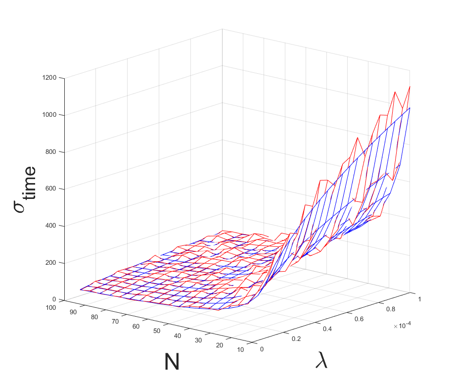

>You can acquire data in either constant time (time is your independent variable and the number of counts is 
>the dependent variable) or constant count (the number of counts is the independent variable and the time is the >dependent variable). You should recall from previous experiments that for a fixed time, the best estimation of 
>the uncertainty in the number of counts, N, is √N. If you acquire to a fixed number of counts, what is the >uncertainty in the measured time (due to the statistical nature of nuclear decay)?

This is a question in one of our level three lab sripts, that we TAs were having difficulty working out the exact solution to. In fact, I believe the question to be slightly malformed. The question asks "what is the uncertainty in the measured time?" The answer to that is simply the precision of the timer, combined with any uncertainty due to reaction time from whatever series of evens is triggering the timer to stop. Although the *predicted* value of time, t, must have a wide range, once an event occurs and the timer is stopped, the t at which that event occured is known within the precision of the timing system as explained above.

What the question *means* to ask, is "What is the standard deviation of the spread of t values after measuring it for a large number of decays?" Just as we can use the standard deviation in detected counts to determine an experimental uncertainty for the Activity (calculated from count rate), we can also consider the counts to be precise measurements, and instead use the standard deviation in the spread of time values to determine this uncertainty. Naturally, if the measurements (and their precision) are identical, we should have identical uncertainties in Activity.

This is a much more interesting question, which is undoubtedly the one intended in the original wording of the question. 

Here is a derivation of the standard deviation in the spread of t values over a number of trials.

We can use this standard deviation to determine the uncertainty in the activity. Likewise, we can do this the more conventional way, but assuming that the timing is highly precision, and that it's the standard deviation in the spread of N over multiple detections, that is the direct source of the uncertainty in the total Activity.

This looks very plausible, but as a scientist, I like to compare it to something. I'm not much of an experimentalist, so a Monte-Carlo method is the obvious way to check my workings here. [The timevar.m script](timevar.m) provides the means to check the analytical result using a Monte-Carlo simulation. Surface plot of the analytical and numerical results (blue and red, respectively) are show below.

